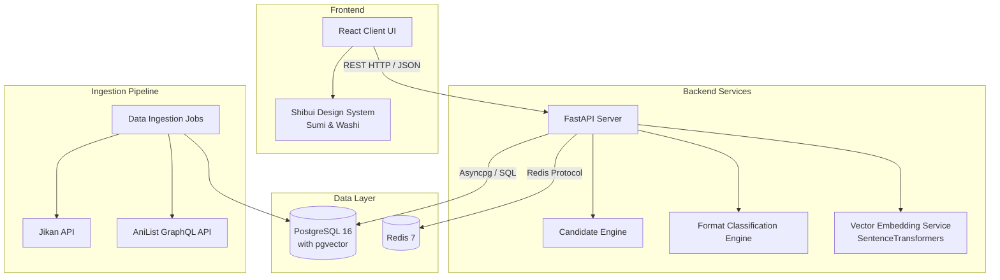

# Mitsu System Architecture

This document outlines the high-level architecture, technology stack, and core subsystems of the **Mitsu** manga discovery and recommendation engine.

## 1. System Overview

Mitsu is a full-stack, AI-powered manga recommendation system built over a database of 95,000+ manga titles sourced from Jikan (MyAnimeList) and AniList. 

It provides:
- Natural language query vector search
- Multi-field database filtering
- LLM recommendation reasoning
- Hybrid trope comparison ("Like X but Y")
- Instant Redis-backed Discovery Roulette
- Japanese-aesthetic UI (Sumi Ink & Washi Paper themes)

## 2. High-Level Architecture Diagram

## 3. Technology Stack

### Frontend
- **Framework**: React (Vite)
- **Styling**: Vanilla CSS (CSS Variables for tokens)
- **Design System**: Custom Japanese Shibui aesthetic (Sumi & Washi themes, Mon glyphs)

### Backend
- **Framework**: FastAPI (Python 3.11+)
- **Vector Model**: SentenceTransformers (`all-MiniLM-L6-v2`, 384-dimensional embeddings)
- **Middleware**: Brotli ASGI compression with GZip fallback

### Data & Caching
- **Database**: PostgreSQL 16 + `pgvector` extension
- **Connection Pooling**: `asyncpg` / `psycopg2` (`pool_size=15, max_overflow=20`)
- **Cache/Queue**: Redis 7

## 4. Core Subsystems

### 4.1. Format Classification Engine
A zero-leakage isolation engine that ensures Manga, Manhwa, and Manhua results do not cross-contaminate.
- **SQL Level**: Mutually exclusive `WHERE` clauses based on Unicode ranges (Hangul, Hanzi, Kana) and tags.
- **Python Level**: Post-retrieval label inference mirroring the SQL logic to gracefully handle ambiguous entries.

### 4.2. Redis-Backed Candidate Engine (Discovery Roulette)
Designed for high-performance, low-latency candidate draws ("Surprise Me" feature).
- **Candidate Pools**: Pre-generated and stored in Redis under `roulette:pool:{filter_hash}`.
- **Session Tracking**: Deduplication via Redis Sets to ensure users never see the same manga twice in a session.
- **Atomic Refill**: Non-blocking background refill using Redis locks. Isolated `AsyncSessionLocal()` sessions prevent database connection collisions.
- **Sampling**: Replaced slow `ORDER BY RANDOM()` with fast pseudo-random `hashtext()` ordering.

### 4.3. Data Ingestion & Enrichment Pipeline
A modular, decoupled pipeline for building the manga database:
- **Discovery**: Iterative scraping of targets from Jikan API into `manga_raw`.
- **Enrichment**: Augmentation with AniList GraphQL metadata (tags, high-res covers).
- **Merge**: Deduplication and linking of MAL/AniList IDs into `manga_canonical`.
- **Embedding**: Batch generation of 384-dimensional dense vectors combining synopsis, genres, and tags.

### 4.4. State-Driven Frontend Boarding Pass Slider
The core Discovery Roulette UI is controlled by a continuous 4-step state machine:
1. Current card slides off-screen left.
2. Loading capsule with Mitsu Mon Glyph (`❖`) slides in from right to center.
3. System waits for backend API response and **100% image pre-loading**.
4. Loading capsule slides left as the new card slides in from the right.

### 4.5. Hybrid Vector Search Engine
Combines explicit scalar filtering (year, score, status, genres) with cosine distance vector retrieval (`<=>` operator via HNSW index on `pgvector`). Supports "Like X but Y" queries by manipulating the embedding space dynamically.

## 5. Data Models (Key Schemas)

**`manga_canonical`** (Master Record Table)
- Core attributes: `id`, `mal_id`, `anilist_id`, `title`, `title_english`, `synopsis`, `cover_image_url`
- Metrics: `average_score`, `chapters`, `volumes`
- Categorization: `genres` (array), `tags` (array), `format_type`, `is_nsfw`
- Vector Index: `embedding vector(384)` (HNSW indexed)

## 6. Directory Layout

- `/app/`: Fastapi application, routes, services, ingestion modules
  - `/app/services/`: Format classification, retrieval logic, cache handling
  - `/app/routers/`: API endpoints (`/recommend`, `/roulette`, `/manga`, `/search`)
  - `/app/ingestion/`: Pipeline scripts for data gathering
- `/frontend/`: React + Vite application
  - `/frontend/src/components/`: Reusable UI components
  - `/frontend/src/index.css`: Design system CSS variables and token declarations
- `/tests/`: Automated test suite (`pytest-asyncio`)
